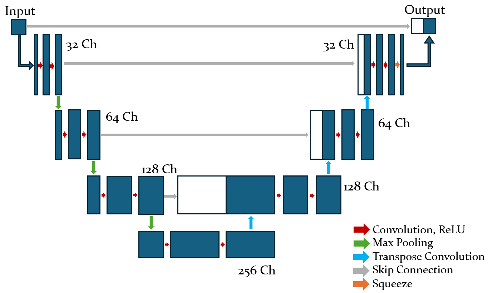
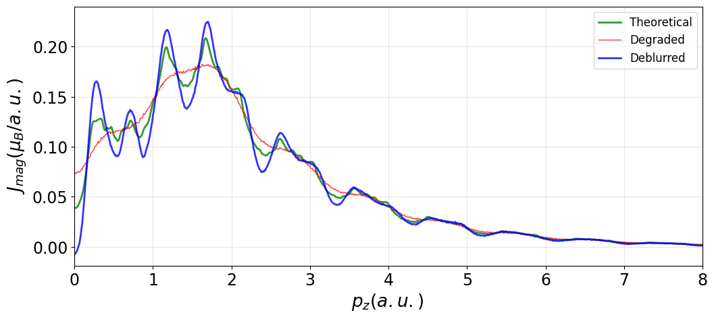

# Deconvolution by Machine Learning

Final year dissertation project — University of Bristol, Physics BSc (2026)

## Overview
This project investigates the use of machine learning methods to deconvolve 
experimental data, with applications to Fermi surface research. Deconvolution 
is the process of recovering a true signal from a measured output that has been 
blurred by a known point spread function.

## Methodology
The project progressed through three main stages:

**1. Richardson-Lucy Algorithm**  
Implemented the classical iterative RL deconvolution algorithm as a baseline. 
While effective on simple functions, it proved prone to noise amplification 
and artefact generation.

**2. Neural Network Approaches**  
- Developed a **Multilayer Perceptron (MLP)** as an initial neural approach — 
  results were poor compared to RL
- Developed a **Convolutional Neural Network (CNN)** which produced 
  significantly more accurate reconstructions
- Finally, a **U-net** style architecture provided the most accurate representation
- Models trained in PyTorch on synthetic data

**3. Combined CNN + RL**  
Combined the CNN with the Richardson-Lucy algorithm to leverage the strengths 
of both approaches, achieving the best overall results.

## Results
Oputperforms previous attempts to deconvolute Compton profiles by improving resoluton by 0.25 atomic units.

*U-net architecture*

*Blurred and reconsturctured Magnetic Compton Profile of Nickel*

## Repository Structure

Code/

├── Richardson_lucy_algo.ipynb     # RL algorithm 

├── Richardson_lucy_functions.py   # RL helper functions

├── MLP_NN.ipynb                   # MLP neural network approach

├── CNN.ipynb                      # CNN implementation and training

├── CNN and RL combined.ipynb      # Final combined approach

├── Deconvolve.ipynb               # Deconvolution pipeline

├── Training_data.ipynb            # Training data generation

├── models_and_training_functions.py # Shared model utilities

├── deblur_model.pth               # Trained CNN model weights

└── deblur_cnn_model_complete.pth  # Complete trained model

## Technologies
- Python, PyTorch, NumPy, Matplotlib, Scipy
- Jupyter Notebook

